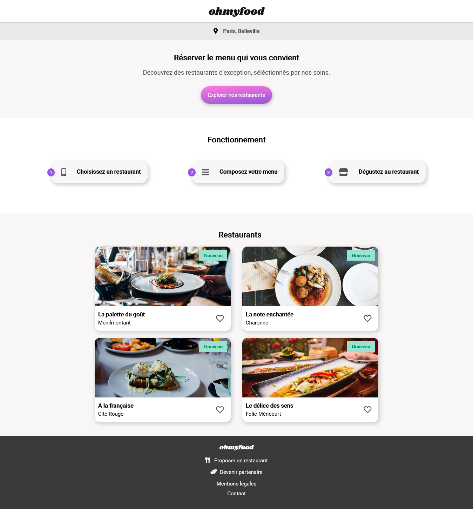
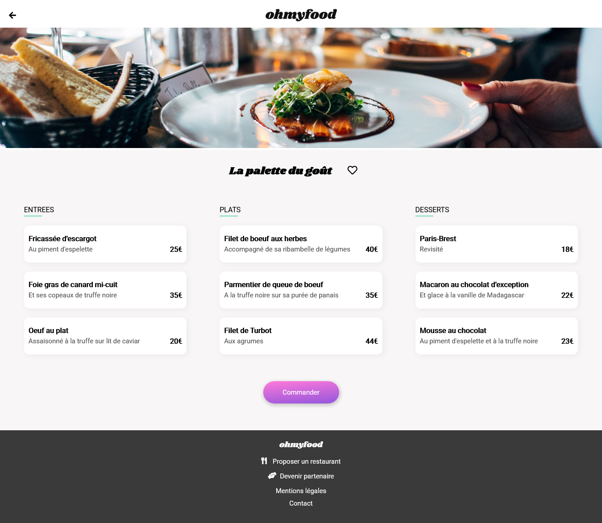
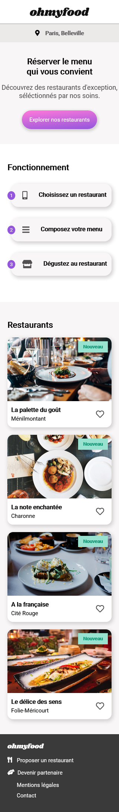
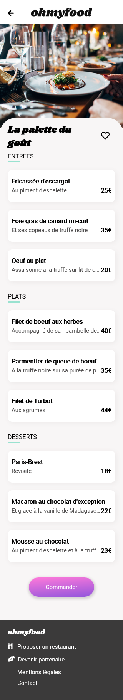

# Ohmyfood
*Projet fictif de formation n°02/11 / OpenClassrooms*

### Home page

### Selected restaurant 

### Mobile version 

## Besoin 
Site de commande de repas en ligne, le concept permet aux utilisateurs de composer leur propre menu et aux restaurants de le préparer à l'avance. Fini les pertes de temps à consulter la carte et à préparer la commande !

## Problématique 
Développer un site 100% mobile qui répertorie les menus de restaurants gastronomiques et intègre un système de commande anticipée en plus du classique système de réservation

## Livrable 
   - intégration mobile-first HTML de la page d'accueil
   - intégration de 4 pages, contenant chacune le menu d’un restaurant
   - intégration des effets graphiques et animations

## Compétences développées 
   - Mettre en place une structure de navigation pour un site web
   - Mettre en œuvre des effets CSS graphiques avancés
   - Assurer la cohérence graphique d'un site web
